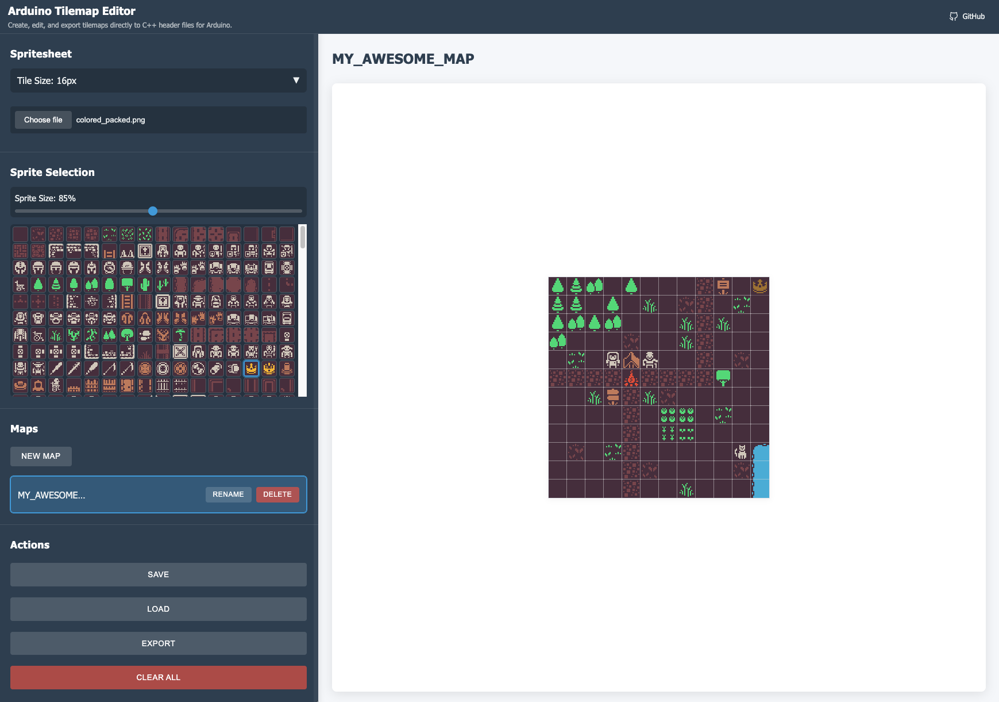

# Arduino Tilemap Editor

Create, edit, and export tilemaps directly to C++ header files for Arduino and ESP32 devices.



## Live Demo

You can try the application online at [https://halftheopposite.github.io/arduino-tilemap-editor](https://halftheopposite.github.io/arduino-tilemap-editor)

## Features

- Create and edit tilemaps with customizable dimensions
- Import spritesheets and select tiles from them
- Export maps and sprites as C++ header files optimized for Arduino/ESP32
- Uses PROGMEM to store data in flash memory instead of RAM
- Saves your work in the browser's local storage

## Why Arduino/ESP32 Needs This

Arduino and ESP32 microcontrollers have very limited RAM (typically 2-8KB for Arduino, 320KB for ESP32). When creating games or graphical applications, storing tile maps and sprite data directly in RAM would quickly exhaust available memory.

This tool addresses this challenge by:

1. **Using PROGMEM**: The exported header files use the `PROGMEM` directive, which tells the compiler to store the data in flash memory (which is much larger) instead of RAM.

2. **Optimized Data Format**: Sprites are converted to a 1-bit monochrome format, significantly reducing memory requirements compared to full-color images.

3. **Only Including Used Sprites**: The exporter analyzes your tilemap and only includes sprites that are actually used, saving precious memory.

## Example Output

### maps.h

```cpp
#ifndef MAPS_H
#define MAPS_H

const unsigned char MAP_LEVEL_1[] PROGMEM = {
  0, 1, 1, 1, 1, 1, 0,
  1, 0, 0, 0, 0, 0, 1,
  1, 0, 2, 0, 3, 0, 1,
  1, 0, 0, 0, 0, 0, 1,
  0, 1, 1, 1, 1, 1, 0
};

#endif
```

### sprites.h

```cpp
#ifndef SPRITES_H
#define SPRITES_H

#define SPRITE_WIDTH 8
#define SPRITE_HEIGHT 8

const unsigned char SPRITE_1[] PROGMEM = {
  0x3c, 0x42, 0x81, 0x81, 0x81, 0x81, 0x42, 0x3c
};

const unsigned char SPRITE_2[] PROGMEM = {
  0x00, 0x7e, 0x42, 0x42, 0x42, 0x42, 0x7e, 0x00
};

const unsigned char SPRITE_3[] PROGMEM = {
  0x3c, 0x7e, 0xff, 0xff, 0xff, 0xff, 0x7e, 0x3c
};

#endif
```

## Using the Exported Files in Arduino

```cpp
#include <Arduino.h>
#include "maps.h"
#include "sprites.h"

// Example for e-paper display
#include <GxEPD2_BW.h>

void drawMap(GxEPD2_BW& display, int startX, int startY) {
  for (int y = 0; y < 5; y++) {
    for (int x = 0; x < 7; x++) {
      // Read tile ID from PROGMEM
      byte tileId = pgm_read_byte(&MAP_LEVEL_1[y * 7 + x]);

      // Draw the appropriate sprite based on tile ID
      if (tileId == 1) {
        drawSprite(display, SPRITE_1, startX + x * SPRITE_WIDTH, startY + y * SPRITE_HEIGHT);
      } else if (tileId == 2) {
        drawSprite(display, SPRITE_2, startX + x * SPRITE_WIDTH, startY + y * SPRITE_HEIGHT);
      } else if (tileId == 3) {
        drawSprite(display, SPRITE_3, startX + x * SPRITE_WIDTH, startY + y * SPRITE_HEIGHT);
      }
    }
  }
}

void drawSprite(GxEPD2_BW& display, const unsigned char* sprite, int x, int y) {
  for (int sy = 0; sy < SPRITE_HEIGHT; sy++) {
    for (int sx = 0; sx < SPRITE_WIDTH; sx += 8) {
      // Read byte from PROGMEM
      byte data = pgm_read_byte(&sprite[(sy * SPRITE_WIDTH + sx) / 8]);

      // Draw 8 pixels (1 byte)
      for (int bit = 0; bit < 8; bit++) {
        if (data & (0x80 >> bit)) {
          display.drawPixel(x + sx + bit, y + sy, GxEPD_BLACK);
        }
      }
    }
  }
}
```

## Development

### Prerequisites

- Node.js (v14 or higher)
- Yarn

### Installation

```bash
# Clone the repository
git clone https://github.com/halftheopposite/arduino-tilemap-editor.git
cd arduino-tilemap-editor

# Install dependencies
yarn install

# Start the development server
yarn start
```

The application will be available at http://localhost:3000

### Building

```bash
yarn build
```

This will create a production build in the `public` directory.

## Deployment

The application is automatically deployed to GitHub Pages when changes are pushed to the main branch using GitHub Actions.

## License

MIT
